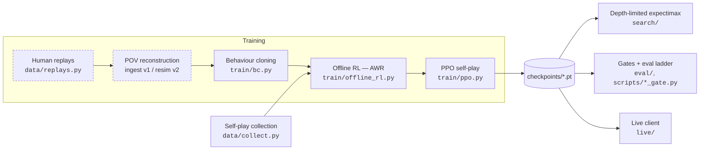

# RotomAI

A competitive Pokémon Showdown battle agent, trained and evaluated end to end against a pinned local
simulator. Behaviour cloning → offline RL → PPO self-play, across three formats — `gen9randombattle`,
`gen9ou` and `gen9vgc2025regi` — with **every published number gated on a pre-registered evaluation**
and the negative results kept.

[**Results**](#results) · [**Scale & systems**](#scale--systems) · [**How it works**](#how-it-works) ·
[**Challenge it**](#challenge-rotomai) · [**Operations**](docs/OPERATIONS.md) ·
[**Build log**](docs/RESULTS.md) · [**Write-up**](paper/rotomai.md) · [**Design doc**](plan.md) ·
[**Releases**](https://github.com/BhaveshThapar/RotomAI/releases)


*Turns 13–17 of `battle-gen9ou-2666751310`, a real rated ladder game against a 1004-Elo human — the
agent's Kingambit closes 6–3. This is the battle **log** rendered directly
([`scripts/make_battle_gif.py`](scripts/make_battle_gif.py), no dependencies, no browser), not the
Showdown sprite view; the log is the authoritative record and the sprites are a rendering of it.*

---

## Quickstart

```bash
conda env create -f environment.yml && conda activate rotomai
bash scripts/setup_server.sh          # vendored Showdown at a pinned rev, builds dist/
bash scripts/run_server.sh &          # ws://localhost:8000

python -m rotomai.cli evaluate --p1 heuristic --p2 random --n 20 --format gen9ou
```

The rule-based baseline against `random` on a local server, printing a win rate. **No weights, no
GPU, no network** — team pools for the teambuilt formats are committed and defaulted per format.
`rotomai --help` lists the rest; [docs/OPERATIONS.md](docs/OPERATIONS.md) covers training,
evaluation, the cluster and live play, and [Develop](#develop) is the test / lint / type bar.

To play the *trained* agents, fetch the release weights — see
[Using the released weights](#using-the-released-weights).

---

## Results

| goal | status | headline |
|---|---|---|
| **G1** live play | **run on the public ranked ladder** | 100 pre-registered rated gen9ou games: Elo **1004** / GXE **30%** — pre-registered **WEAK** |
| **G2** strong-human on one format | **met, both halves** | gen9ou **0.7303** vs poke-env's `SimpleHeuristicsPlayer` (n=9000), **0.7513** vs the in-repo heuristic; agent-only ladder **Glicko 1776.3 / GXE 0.7434** |
| **G3** continual improvement | **booked** | five-dose self-play curve, monotone on both reads (80 → 320 updates) |
| **G4** ≥3 formats through one core | **met** | `gen9randombattle`, `gen9ou`, `gen9vgc2025regi` end to end |
| **G5** skill stack as testable capability | **met** | four capabilities, each on its own gate's criterion |

**The strength number, against a baseline that is not ours.** `simpleheuristics` here *is* poke-env's
`SimpleHeuristicsPlayer`, imported unmodified — the rule-based baseline the field inherits — so this
row is the one an outside reader can situate:

| arm | opponent | task | n | score rate (Wilson 95%) |
|---|---|---|---|---|
| v26b terminal, greedy, LoopGuard 4 | poke-env `SimpleHeuristicsPlayer` | **gen9ou**, 12-team committed pool | **9000** | **0.7303** [0.7211, 0.7394] |
| v26b terminal, same protocol | in-repo `heuristic` — *control* | gen9ou, same pool | 9000 | 0.7504 [0.7414, 0.7593] |
| v26b terminal | in-repo `heuristic` — *published* | gen9ou, same pool | 5400 | 0.7513 [0.7396, 0.7626] |

Every seed's best checkpoint is scored and pooled, so these are selection-free terminal reads. Each
row is **three independent runs** in separate Slurm allocations across two nodes, pooled — because
this project has measured identical checkpoints at 0.472 and 0.499 in two runs, and one read cannot
tell "this arm" from "this run" apart:

| run | simpleheuristics | heuristic |
|---|---|---|
| tron62, 01:00 / 01:46 | 0.7293 | 0.7500 |
| tron65, 02:14 | 0.7357 | 0.7563 |
| tron62, 02:27 | 0.7260 | 0.7450 |
| **pooled, n=9000** | **0.7303** | **0.7504** |

Two things settle it. The three runs span **0.0097** on the headline opponent and **0.0113** on the
control — both well inside a single run's own interval. And the pooled control re-reads the
*published* baseline at **0.7504** against 0.7513, **0.0009** apart. The opponent gap holds at
**0.0201**: poke-env's baseline is consistently the harder of the two, so the rebase moved the
headline down.

**The replication is itself a result.** Individual checkpoints swung up to **0.028** across runs —
same weights, same opponent, same settings — while the seed-pooled read moved **0.0097**. Pooling
over seeds is what buys run-to-run stability, and a single n=300 cell buys none: the `eval-ladder`
record already held a v26b-s0 vs `simpleheuristics` cell at **0.8167** (n=300), against 0.741, 0.769
and 0.761 for that same checkpoint at n=1000. Small-n cells on a twelve-team pool cluster by team
matchup and cannot carry a comparison.

Numbers commonly cited elsewhere against `SimpleHeuristicsPlayer` (~85%) are on **gen8randombattle**,
where the server supplies both teams. That is a different task from gen9ou with a committed team
pool, where battles cluster by team matchup. The rows sit side by side; they are not differenced.

**Two of the three formats measure as ceiling-bound, and that is a result rather than a shortfall.**
gen9-RB and VGC both return `FORMAT_BOUND` from the three-leg ceiling probe — nothing competent
beats the fixed heuristic there, near-optimal search included — so the project's own instruments say
not to spend more on their strength axes. gen9ou is where headroom was proven and where the strength
result lives.

**Not claimed:** the agent-only Glicko/GXE figure is measured against a **bot field** and is **not**
comparable to a Showdown GXE against humans; and only the self-play axis of G3 has a dose-response
curve, not the replay-data axis.

**Public ranked ladder: run, and the result is WEAK.** One bounded, pre-registered measurement run
on gen9ou — bands, n and the exact command frozen in
[`results/live_ladder_gen9ou_prereg.json`](results/live_ladder_gen9ou_prereg.json) **before the
first rated game**, including the statement that a weak result would be published too. It was.

| | |
|---|---|
| games | **100** (the pre-registered n, played once, no early stop, no top-up) |
| record | **35–65**, score rate **0.350** [0.264, 0.448] |
| **Elo / GXE** | **1004** / **30%** — pre-registered WEAK is Elo < 1200 or GXE < 45% |
| Glicko | 1339.5 ± 36.0 |
| clean-run check | `ladder_games_delta` **0** — the ladder charged exactly the games observed; 0 restarts |

**This is the most useful number here, precisely because it is bad.** The same checkpoint scores
0.7303 against poke-env's shared baseline and 0.350 against ~1055-Elo humans. Both are correct;
they measure different things. **A bot-baseline win rate does not predict human-ladder
performance** — and no amount of further self-play against a fixed heuristic could have shown that,
because every instrument this project had pointed at an agent field.

The diagnosis is specific rather than vague: the policy never saw the human metagame. It trained on
self-play plus a fixed heuristic, brings a committed 12-team pool against opponents who bring
anything, and decides from a 761-d **single-turn** observation with no trajectory context.

**And the obvious next step is the one this repo has already measured as null.** "BC on human
replays, then offline RL" is not missing here — it is the production lineage, it ran end to end on
2,760 rated gen9ou replays, and it booked Gate B RED and Gate B2 RED; a from-scratch control matched
the BC warm-start at 0.6485 accuracy *exactly*, so the warm start contributed nothing to final
strength. The ladder checkpoint already descends from that lineage. What has **not** been tried is
the part the ladder write-up actually indicts: the missing time axis. That is
[`results/history_bc_prereg.json`](results/history_bc_prereg.json) — history-conditioned BC → AWR →
PPO against the existing flat lineage as the control arm, pre-registered, NULL declared the likeliest
outcome.

**Stages 1–2 ran, and a pre-registered kill criterion stopped them there.** Control seed 1's AWR
value-MAE came in at **0.6304** against a declared line of 0.60. Read per seed it trips; read as an
arm mean (0.5731 / 0.4793) it does not, and the gate never said which — so the strict reading was
honoured and **PPO was not launched**. The trip is on the *control* arm, not the arm under test,
which is exactly why it was not argued around. The ambiguity and the wording fix for future gates are
in [`results/history_bc_prereg_amendment.json`](results/history_bc_prereg_amendment.json), a separate
dated file; the original pre-registration is untouched.

BC accuracy did move a long way — control **0.6562 ± 0.0062**, history **0.7708 ± 0.0551** — and two
attempts to explain it away both failed: neighbour leakage from the row-level split is flat across
exposure (0.6845 / 0.7229 / 0.7024, though at low power), and "repeat the previous action" scores
0.2081 against a 0.2123 majority baseline. The one confound still open is the row-level split itself,
now being re-read with an episode-grouped split where no battle spans train and val. **No strength
number is claimed**: the primary readout needs PPO, and this project has already measured a BC
warm-start contributing nothing to final strength.

Its blocking precondition has passed. The human-replay BC shard was lost to a scratch teardown and
cannot be re-fetched without confounding the comparison, so it is **reconstructed** from the
surviving offline-RL shard — 61,766 rows against the 61,723 the build log records, **0.07%** — and
[`results/bc_shard_fidelity_gate.json`](results/bc_shard_fidelity_gate.json) confirms it trains to
0.6541 ± 0.0078 against a recorded 0.647. **Its negative control also passed**, so validation
accuracy does not discriminate the correct reconstruction from a deliberately wrong one; the gate
reports `control_has_teeth: false` rather than quoting the PASS alone. What justifies the
reconstruction is the row count, not that gate.

**The write-up.** The methodology result — what it costs to measure a small effect in self-play RL,
and why a bot-baseline win rate does not license a claim about human-relative strength — is written
up in **[paper/rotomai.md](paper/rotomai.md)**, with a shorter version in
[blog/rotomai.md](blog/rotomai.md). Its figures are generated straight from the committed result
JSONs by `python scripts/make_figures.py`, so a figure cannot drift from the record; a test fails if
one does.

Full experimental record, every build in the order it ran with its pre-registration and verdict:
**[docs/RESULTS.md](docs/RESULTS.md)**. The design document, requirements and milestone roadmap are
in [plan.md](plan.md).

---

## Scale & systems

Every number above was produced on **CPU only**, on a shared Slurm cluster, by an orchestration layer
that had to be measured rather than guessed.

| | |
|---|---|
| hardware | **no GPU, ever** — the net is 4.56M parameters and RAM is the binding constraint (64 GB/task) |
| throughput | **209–242 self-play battles/min** at concurrency 20, measured |
| a training build | **107 task-hours ≈ 32 h wall-clock**, 9 arms × 120–160 PPO iterations, 4.8–5.3 min/iter |
| real parallelism | **4 concurrent tasks**, not 9 — the `tron` QoS caps a user at `cpu=32,mem=256G` and every job asks 8 CPU / 64 GB, so estimate in **task-hours ÷ 4** |
| binding constraint | **disk, not time** — ~17.5 MB/checkpoint × 160 iterations × 9 arms ≈ **23 GB** per build |
| durable record | 251 committed `results/*.json`, per-iteration `curve.json` per arm, per-job telemetry JSON |

**The bug worth stating out loud: two jobs on one node silently shared a simulator.** poke-env's
`LocalhostServerConfiguration` hardcodes `ws://localhost:8000`. Slurm array tasks routinely land on
the same node (measured: `7141999` tasks 1 and 2 both on `tron64`), so two arms opened the same
Showdown server and battled into *each other's* games — no error, no warning, and a comparison that
looked fine and was corrupt. The fix is a per-task port: `scripts/cluster/_job_common.sh` computes
`8100 + TASK_ID`, and each non-array wrapper claims a base clear of the others. `results/` has the
same failure mode — a gate's `--out` is a global, and two overlapping jobs with the same path leave
only the later one's JSON; Build 28 lost two of six reads that way before it was caught.

Full resource verdicts, the port-base allocation and the submission recipes:
[docs/OPERATIONS.md](docs/OPERATIONS.md#cluster) and
[scripts/cluster/README.md](scripts/cluster/README.md).

---

## How it works



A 761-d single-turn observation (`features/encoder.py`; 888-d for doubles) through a shared
actor-critic or entity-transformer trunk, deployed greedily. The dashed arm is honest rather than
decorative: the replay pipeline is built and tested, but the replay-data axis was measured once and
never scaled, so no claim rests on it. Self-play is the axis with a dose-response curve.

**Operational manual — environment, cluster, pipelines, live play:
[docs/OPERATIONS.md](docs/OPERATIONS.md).**

---

## Challenge RotomAI

The live client's default mode is `accept`: it takes **opt-in challenges only**, and `--n 0` makes
it a standing service rather than a fixed-length run. One command, on any 1 GB box:

```bash
export ROTOMAI_PS_USERNAME=YourBotAccount ROTOMAI_PS_PASSWORD=...

python -m rotomai.cli live --mode accept --n 0 \
  --agent offrl --checkpoint checkpoints/ppo_v26b_s0/iter_320.pt \
  --format gen9ou --concurrency 1 --battle-delay 10 --out-dir results/accept
```

Then challenge that account to a `[Gen 9] OU` game on [Pokémon Showdown](https://play.pokemonshowdown.com/).
`--opponent a,b,c` narrows it to an allowlist. Ctrl-C finishes the battle in progress, flushes the
record and exits; a second Ctrl-C abandons it.

A [`Dockerfile`](Dockerfile) and a [systemd unit](deploy/rotomai-accept.service) are committed for
the always-on version, and [`requirements-live.txt`](requirements-live.txt) pins the exact versions
the published ladder run was played on — `pyproject.toml` declares floors, which is right for a
library and wrong for a service, since `rotomai/live/` is written against poke-env 0.15 semantics in
particular.

**What you will be playing.** The gen9ou policy that scored **0.7303 against poke-env's
`SimpleHeuristicsPlayer`** and **Elo 1004 / GXE 30% against humans**. It is a weak-to-average ladder
opponent that will nonetheless punish a loose switch — see [the ladder result](#results) for why
those two numbers disagree.

**Ranked play is a different, gated path.** `--mode ladder` additionally requires `--ladder-ack` and
`ROTOMAI_LIVE_ALLOW_LADDER`, and it refuses `--n 0` outright: a rated run's *n* is its
pre-registration, and an open-ended one is a selected sample by construction. `accept` mode is
ungated because a human chose to press the challenge button.

---

## Using the released weights

**The weights are on the release.** Three checkpoints, 23 MiB, one playable policy per teambuilt
format:
[v1.0.0](https://github.com/BhaveshThapar/RotomAI/releases/tag/v1.0.0).
**Restore the paths as you download** — the manifest keys on them, and the gen9ou asset is attached
under the bare name `iter_320.pt`, which does not say which arm it came from:

```bash
B=https://github.com/BhaveshThapar/RotomAI/releases/download/v1.0.0
mkdir -p checkpoints/ppo_v26b_s0
curl -sL -o checkpoints/ppo_v26b_s0/iter_320.pt  $B/iter_320.pt          # gen9ou, 17.4 MiB
curl -sL -o checkpoints/doubles_offrl_vgc_v2.pt  $B/doubles_offrl_vgc_v2.pt
curl -sL -o checkpoints/doubles_bc_vgc_v2.pt     $B/doubles_bc_vgc_v2.pt

python scripts/release_assets.py --verify        # want: 3/3 release assets present and verified

python -m rotomai.cli evaluate --p1 offrl --p1-checkpoint checkpoints/ppo_v26b_s0/iter_320.pt \
  --p2 heuristic --n 100 --format gen9ou         # the gen9ou ladder top vs the fixed baseline
```

Measured by doing exactly the above into a clean `v1.0.0` clone: `3/3` verified, then **0.825 over
40 battles** on gen9ou and **0.450 over 20** on VGC — the published 0.7513 and 0.467 at small n.

**Verify before you load.** A checkpoint is a pickle and `torch.load` executes code from it, so
"trust the file on the release page" is not a security posture. `results/release_assets.json`
carries the sha256 and byte length of each asset, is committed, and is derived from
`check_artifacts.HEADLINE` rather than hand-kept, so it cannot drift from the claims those weights
back. `--verify` gates on the release assets only; the other 15 checkpoints the manifest lists are
provenance for published curves and were never going to be on your machine, so it says so rather
than reporting them as a failed download.

---

## Develop

```bash
pytest            # 942 tests, both figures MEASURED rather than projected.
                  #   Full dev box (node ON PATH, a local server up, checkpoints/ + data/ +
                  #     replays/ staged):            935 pass,  7 skip
                  #   Fresh worktree (none of the above, which is CI's condition):
                  #                                  919 pass, 23 skip
                  #   Every one of the 23 self-gates on something a clone does not have and names
                  #   its reason. An UNexplained skip is a regression, not noise.
                  #   Run it as `pytest`, not `python -m pytest`: pyproject sets pythonpath so the
                  #   two agree, and CI runs the bare form -- and `python -m pytest` has already
                  #   hidden a total collection failure here once.
ruff check .
mypy rotomai scripts   # both trees; CI runs the same two arguments
```

Reading the CI result without `gh` (there is none on the dev host, which is why a red CI once went
unnoticed for eleven commits): [docs/OPERATIONS.md](docs/OPERATIONS.md#reading-ci-without-gh).

---

## Layout

| Path | Role |
|---|---|
| `rotomai/config.py` | Local server config + format constants |
| `rotomai/engine/damage.py` | Expected-damage / move-value estimator |
| `rotomai/features/` | `embed_battle` 761-d singles encoder (`OBS_LAYOUT`) / 888-d doubles encoder + action-space codec |
| `rotomai/model/` | MLP actor-critic + entity transformer + build factory |
| `rotomai/agents/` | `heuristic`, `bc`, `offrl`, `ppo` agents |
| `rotomai/data/` | self-play collection, reward, replay fetch / ingest (v1) / resim (v2), trajectory context (`history.py`) |
| `rotomai/train/` | BC, offline RL, self-play, PPO training loops |
| `rotomai/search/` | R-PREDICT: forward model, determinization, expectimax, opponent model |
| `rotomai/teambuilding/` | R-TEAM: validator-checked packed team pools for teambuilt formats |
| `rotomai/eval/arena.py` | run N battles vs one fixed baseline, report win rates |
| `rotomai/eval/rating.py` | R-EVAL: Glicko-1 + GXE (degenerate against a fixed baseline — read the docstring) |
| `rotomai/eval/ladder.py` | agent-only eval ladder: round-robin + joint rating fit (the varied field G2 needs) |
| `rotomai/live/` | M5 deploy / G1: live-server client, policy gate, session supervisor, telemetry |
| `rotomai/cli.py` | all subcommands (eval / collect / train / data / live) |
| `scripts/` | local Showdown server + simulator setup/run, and every experiment gate |
| `paper/`, `blog/` | the write-up; figures regenerated from `results/` by `scripts/make_figures.py` |
| `assets/` | the demo GIF and the SVG figures -- both generated, both committed |
| `Dockerfile`, `deploy/` | the always-on `--mode accept` service |

---

## Artifacts & reproducibility

**A clone of this repo contains no weights and no training shards.** `checkpoints/` and `data/` are
gitignored, so every published number was produced from files that exist only on the machine that
ran them. What *is* committed, and is the durable record, is the evidence rather than the artifacts: 251
`results/*.json` gate summaries, each arm's per-iteration `curve.json`, the validator-checked packed
team pools (`rotomai/teambuilding/data/`), the encoder vocab and the gen9ou usage prior
(`rotomai/features/data/`), and the pinned simulator rev.

**Which record backs which headline.** These name result files rather than checkpoint paths, because
a gate can be re-pinned and a result file cannot:

| headline | record |
|---|---|
| gen9ou **0.7513** selection-free terminal | `results/ppo_ou_gate_v26b_terminal.json`, `results/seed_strength_gate_v26_terminal.json` |
| ranked ladder **Elo 1004 / GXE 30%** (n=100, WEAK) | `results/live_ladder_gen9ou.json`, `results/live_ladder_gen9ou_prereg.json`, `results/live_ladder_gen9ou_seg{0,1,2,3}.json` |
| gen9ou **0.7303** vs poke-env `SimpleHeuristicsPlayer` (n=9000) | `results/seed_strength_gate_v26b_simpleheuristics{,_paired}.json`, `results/seed_strength_gate_v26b_heuristic_{control,paired}.json` |
| Glicko **1776.3** / GXE **0.7434** | `results/eval_ladder_gen9ou_v26.json` |
| VGC B6f C1 **0.530** | `results/ppo_vgc_gate_b6f{,_s0,_s1,_s2}.json`, `results/seed_strength_gate_b6f_c1.json`, `results/awr_vgc_arm_b6f.json` |
| VGC corrected ladder **BC 0.453** / **AWR 0.467** | `results/format_ceiling_gate_vgc_v2.json` |
| **G5 MET** — four capabilities, each on its own gate's criterion | `results/g5_capability_gate.json` |

Every checkpoint those records name is present on the machine that produced them, and none of them
ship. `python scripts/check_artifacts.py` re-derives that statement rather than trusting this table.

**58 of the 122 checkpoint paths named across `results/**.json` no longer exist**, cited by 52 of the
251 result files. 27 are top-level warm starts (`bc_gen9ou_v*.pt`, `offrl_scale_*.pt`); the rest are
whole absent arm directories (`ppo_ou_*`, `ppo_scale_*`, `curriculum_*`). The cause is scratch
teardown, not pruning: `scripts/prune_checkpoints.py` iterates directories only
(`plan_prune`, `p.is_dir()`) and only ever `unlink()`s files, so top-level `*.pt` and whole arm dirs
were never candidates. **No headline claim is among the 58** — they back superseded intermediate
builds whose measured numbers remain in the JSON. A reader following an older record to a file will
find nothing; that is a known state, recorded here rather than left to be discovered.

**What pruning is allowed to take.** Distinct from the above, and now load-bearing: 234 intermediate
checkpoints (0.657 GiB) *were* deleted by that script, from the three `ppo_b6f_*` arms. An arm
directory keeps four things — any checkpoint a committed `results/*.json` names, the arm's terminal
iteration whether or not a result names it, `curve.json`, and any file it does not recognise. Every
top-level `checkpoints/*.pt` is out of scope entirely. What goes is the rest: intermediates that
existed so `argmax` had something to range over. Dry run is the default and `--apply` is required,
because an arm is ~40 h of wall-clock and cannot be re-derived from its curve. The rules themselves
live in `scripts/prune_checkpoints.py`'s docstring; `python scripts/prune_checkpoints.py` re-derives
them rather than trusting this paragraph.

**What a clean clone can and cannot reproduce.** It can run the whole pipeline end to end — setup,
collect, train, gate — against a pinned simulator, with the pools, vocab and prior it needs already
committed. It cannot bit-exactly re-derive a published build: an arm is ~40 h of wall-clock and the
shards it trained on are gone. The gate scripts are the reproduction path, not the checkpoints.

---

## License & acknowledgements

This project is MIT-licensed — see [`LICENSE`](LICENSE). `CITATION.cff` carries the citation record.

- **[poke-env](https://github.com/hsahovic/poke-env)** (Haris Sahovic), MIT — the battle-client and
  baseline-player layer every agent here is built on. A pip dependency, declared in `pyproject.toml`.
- **[pokemon-showdown](https://github.com/smogon/pokemon-showdown)** (© 2011–2026 Guangcong Luo and
  other contributors), MIT — the simulator. It is **cloned, not vendored**: `scripts/setup_server.sh`
  fetches it into `third_party/` at the pinned rev `393d5c86`, and `.gitignore` keeps it out of this
  tree entirely. Nothing from it is redistributed here, and its license is its own — read it at
  `third_party/pokemon-showdown/LICENSE` after running the setup script.
