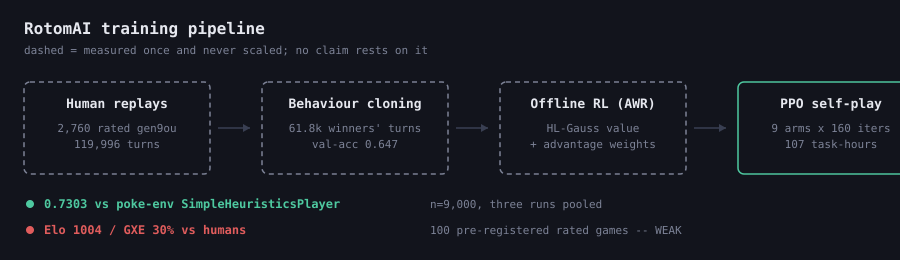
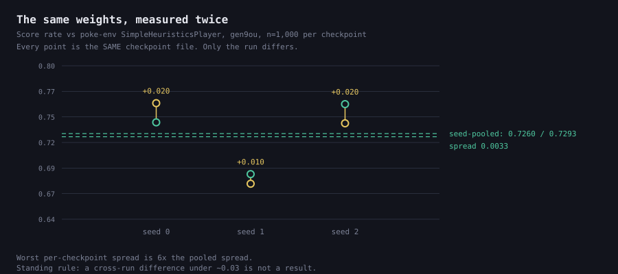
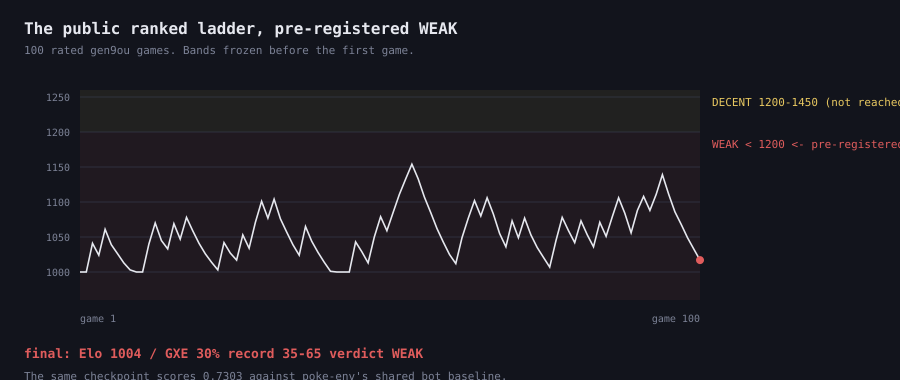

# What it costs to measure a small effect in self-play reinforcement learning

**A field report from 29 builds of a competitive Pokémon agent, on CPUs.**

Bhavesh Thapar · University of Maryland · [github.com/BhaveshThapar/RotomAI](https://github.com/BhaveshThapar/RotomAI)

---

## Abstract

We report a measurement-methodology result from building a competitive Pokémon Showdown agent
(behaviour cloning → offline RL → PPO self-play) under a discipline where every published number is
gated on a pre-registered evaluation and negative results are kept. The central finding is not about
Pokémon. It is that in this setting the *measurement apparatus* — not the learning algorithm — was
the binding constraint on what could be concluded, and that the standard practice of evaluating an
agent against a fixed rule-based baseline does not support the inference it is usually asked to
support.

Three specific results. **(1)** Identical checkpoints, re-scored against the same opponent under the
same settings in two separate runs, moved by up to 0.028 in win rate against a per-read standard
error of 0.023; the seed-pooled read of the same arms moved by 0.0097. We therefore adopted a
standing rule — a cross-run difference below ~0.03 is not a result — and retired several
already-computed comparisons under it. **(2)** A gradient-noise diagnostic we had pre-registered to
detect a 2.2× effect was found to swing 2.7× on the probe seed alone, on a *fixed* checkpoint; the
diagnostic was abandoned rather than reported. **(3)** The same agent scores **0.7303**
[0.7211, 0.7394] over n=9,000 against poke-env's `SimpleHeuristicsPlayer` — the rule-based baseline
the field inherits — and **Elo 1004 / GXE 30%** over 100 pre-registered rated games against humans on
the public Showdown ladder, a pre-registered **WEAK**. Both numbers are correct. A bot-baseline win
rate does not predict human-ladder performance, and no instrument pointed at a bot field could have
revealed that.

We argue that (3) is a general hazard rather than a fact about this agent, and that (1) and (2)
describe the cost — in seeds, in runs, in retired diagnostics — of establishing which differences in
this regime are real.

---

## 1. Setting

The system is a Pokémon Showdown battle agent across three formats (`gen9randombattle`, `gen9ou`,
`gen9vgc2025regi`), trained end to end against a pinned local simulator. The pipeline is behaviour
cloning on human replays, then offline RL (advantage-weighted regression with an HL-Gauss value
head), then PPO self-play. The deployed network is a 4.56M-parameter entity transformer over a 761-d
single-turn observation, with a decoupled two-tower critic.

**It runs on CPUs.** No GPU was ever requested: at 4.56M parameters the binding constraints are RAM
(64 GB per task) and the local simulator's throughput, measured at 209–242 battles/min at concurrency
20. A full PPO build is 9 arms × 120–160 iterations ≈ 107 task-hours; the cluster QoS caps useful
parallelism at four concurrent tasks, so ≈ 32 hours wall-clock. Disk, not time, is the binding
operational constraint: ~17.5 MB per checkpoint × 160 iterations × 9 arms ≈ 23 GB per build.

This matters for the argument. The experiment budget that produced the results below is the budget an
individual researcher actually has, and the measurement problems we describe get *worse*, not better,
as the budget shrinks.

**Discipline.** Gates are declared before the run: the arm, the protocol, the primary readout, the
bands and the stopping rule are committed to a file first, and the verdict is written against them
afterwards. The record is 251 committed result JSONs and a build log in which roughly a third of the
entries are negative results kept at full length.

---

## 2. Identical checkpoints do not score the same twice

The first version of the strength gate scored one checkpoint per arm at n=300 and reported a win
rate. It has two defects, and they compound.

**Underpowered.** At n=300 the binomial standard error is 0.029, so the minimum detectable effect at
z≈2 is about 0.08 — wider than any dose the training levers under test could produce. A gate whose
MDE exceeds its own effect size books a NULL by construction.

**Selected.** Scoring only the *best* checkpoint of the best seed inherits a winner's curse whose
magnitude depends on how many checkpoints the argmax ranged over, which differed between arms.

The fix was to score **every seed's best checkpoint and pool** the results, which raises n threefold
and — because the winner's curse is applied identically to both arms — largely cancels it in the
difference. The standard error falls from 0.041 to 0.024, enough to resolve a 0.07 difference at
z≈3.

What we did not anticipate is how much a *whole run* moves. Re-scoring the identical checkpoint files
of one arm in two separate cluster allocations gave 0.472 and 0.499 — 0.027 apart against a
per-read SE of 0.023. Nothing differed but the run.

A later build re-measured this independently, on a different opponent, at a larger n. Per-checkpoint
rates moved up to **0.028** across runs; the **seed-pooled** read of the same arms spanned
**0.0097**. The worst single-checkpoint spread is six times the pooled spread.

Two consequences, both of which cost us previously-computed results.

**A standing measurement rule.** Cross-run differences below ~0.03 are not results. Several
comparisons already in the build log were re-labelled NULL under it.

**Two inference levels, reported separately.** A pooled read licenses a claim about *these
checkpoints*. A claim about *the training procedure* needs the seed-level analysis, and there the
between-seed standard deviation is ~0.0706 — about 2.5× the within-seed binomial. Raising n does not
close that gap; only more seeds do. Conflating the two is the most available error in this
literature, because the pooled number is both larger and easier to compute.

---

## 3. A diagnostic we retired for being unmeasurable

To decide whether a training stage was gradient-noise-limited, we pre-registered a gate on ‖G‖², the
squared gradient norm, sized to detect a 2.2× difference between two conditions.

Before running it we probed a **fixed** checkpoint twice, changing only the probe seed. ‖G‖² moved by
**2.7×** — larger than the effect the gate had been pre-registered to detect. The instrument could
not distinguish its own noise from the thing it was built to measure.

We retired the diagnostic rather than reporting it, and recorded the rule it produced: a ‖G‖²
difference under ~3× is not measurable at this budget, and any future probe must run at least two
probe seeds. One quantity did survive the probe-seed swing — a cosine similarity that moved 0.312 →
0.317 — and only that one was kept.

We think this generalises. A diagnostic is often adopted because it is cheap and because a published
paper used it, without a null run establishing its own variance. When the diagnostic's seed noise
exceeds the effect, the resulting number is not weak evidence; it is no evidence, and it is
particularly dangerous because it looks like a measurement.

---

## 4. The baseline problem

The strength number every agent in this space reports is a win rate against a fixed rule-based
opponent — for poke-env-based work, `SimpleHeuristicsPlayer`. We report it too, deliberately, because
it is the one number an outside reader can situate: **0.7303** [0.7211, 0.7394] on `gen9ou` over
n=9,000, three independent runs in separate allocations across two nodes, pooled.

Two details of that measurement are worth stating because they are usually omitted. Each row is three
runs, not one, for the reason in §2. And a *control* arm re-read the in-repo heuristic — a baseline
whose value this project had already published at 0.7513 — under the identical protocol at the
identical n, landing at 0.7504, **0.0009** away. That control is what licenses reading the
`SimpleHeuristicsPlayer` figure as a property of the *arm* rather than of the *run*.

Then we played the public ranked ladder.

One bounded, pre-registered run on `gen9ou`: n, bands, account and the exact command frozen in a
committed file before the first rated game, including an explicit statement that a weak result would
be published too. The result was **Elo 1004 / GXE 30%** over 100 rated games, record 35–65 — a
pre-registered **WEAK** (the band was declared as Elo < 1200 or GXE < 45%). The account was charged
for exactly the games observed, with zero reconnects.

**The same checkpoint scores 0.7303 against the shared bot baseline and 0.350 against roughly
1055-Elo humans.** Both are correct; they measure different things.

This is the paper's most useful number precisely because it is bad. The gap is not a bug in either
measurement, and it is not explained by the agent being weak in some uniform way that the bot
baseline should have detected. A rule-based baseline is a *fixed policy*: an agent trained by
self-play against a fixed heuristic can find and exploit that policy's stable weaknesses, and a win
rate against it measures how thoroughly it has done so. Human ladder opponents are a nonstationary,
adversarial, strategically diverse population. Nothing in the first measurement bounds the second.

The diagnosis available from our own record is specific: the policy never saw the human metagame; it
brings a fixed 12-team pool against opponents who bring anything; and it decides from a 761-d
**single-turn** observation with no trajectory context, while the human-level results in this domain
came from sequence models over historical gameplay.

We note what this does *not* show. It does not show that the bot-baseline number is worthless — it is
a real, reproducible property of the agent, and it is what makes cross-project comparison possible at
all. It shows that the inference from it to human-relative strength is unlicensed, and that the only
way to find that out is to run the second measurement.

---

## 5. Threats to validity

Stated plainly, because a methodology paper that hides these is making the error it describes.

- **One ladder run, n=100, one account, one format.** The stopping rule was pre-registered and
  honoured, which means we did not top up after seeing a bad number — and also that the ladder
  estimate has a wide interval (score rate 0.350 [0.264, 0.448]). It is a single bounded sample of
  one agent against one ladder population at one time.
- **No comparison against another published agent under the same protocol.** We compare against a
  shared *baseline*, not against other agents. Cross-evaluation against released agents would be
  stronger and is not done here.
- **Format non-comparability.** Figures commonly cited against `SimpleHeuristicsPlayer` (~85%) are on
  `gen8randombattle`, where the server supplies both teams. That is a different task from `gen9ou`
  with a committed team pool, where outcomes cluster by team matchup. We report the rows side by
  side and do not difference them.
- **Two of three formats are ceiling-bound.** `gen9randombattle` and VGC both return `FORMAT_BOUND`
  from a three-leg ceiling probe — nothing competent beats the fixed heuristic there, near-optimal
  search included. The strength results are `gen9ou` only.
- **The variance estimates are themselves small-sample.** The 0.027 and 0.028 cross-run figures come
  from a handful of paired re-reads, not from a designed variance study. They are enough to justify
  a conservative rule; they are not a precise characterisation of the noise.
- **Operational losses.** Two of six reads in one build were destroyed by a shared output path (§6);
  their numbers survive only in job logs. The figures in this paper plot what is on disk and say so.

---

## 6. Two systems bugs that are measurement bugs

Both were silent, both corrupted comparisons rather than crashing, and both are the kind of thing an
experiment-management section omits.

**A shared simulator.** poke-env's localhost configuration hardcodes `ws://localhost:8000`. Slurm
array tasks routinely land on the same node — we observed tasks 1 and 2 of one array both on the same
host — so two arms opened the *same* Showdown server and battled into each other's games. No error,
no warning, and a comparison that looked fine. The fix is a per-task port derived from the array
index.

**A shared output path.** A gate's `--out` is a global. Two overlapping jobs launched with the same
path both write it and the later one wins, so the earlier run's JSON simply ceases to exist while its
number lives on only in a log file. One build lost two of six reads this way.

The general shape is the same in both cases: a default that is correct for one job and silently wrong
for two. In a regime where the effect under test is ~0.03 and the run-to-run noise is ~0.028, a
silent contamination is not a nuisance — it is the whole result.

---

## 7. What we would tell someone starting

1. **Measure your instrument before you measure with it.** Run the null: same checkpoint, same
   opponent, different run. Whatever that spread is, it is your floor. Ours was ~0.03, and it
   invalidated comparisons we had already computed.
2. **Pool over seeds, and say which inference you are making.** A pooled number is about *these
   weights*; a claim about *the method* needs the seed-level read, and the between-seed variance is
   the one that does not shrink with more battles.
3. **A single small-n cell cannot carry a comparison.** Our own record held a n=300 cell at 0.8167
   for a checkpoint that scored 0.741, 0.769 and 0.761 at n=1,000.
4. **Pre-register the bands, including the bad one.** The ladder result is only interpretable because
   WEAK was defined, and published, before the first game.
5. **Play the humans.** Or whatever the real population is in your domain. It is the only measurement
   that cannot be gamed by the structure of the baseline, and it is cheap relative to the training it
   evaluates — 100 rated games took an afternoon against 107 task-hours of training.

---

## 8. Reproducibility

All gate scripts, pre-registration files and result JSONs are in the repository. `checkpoints/` and
`data/` are not: every published number was produced from files that exist only on the machine that
ran them, and the durable record is the evidence rather than the artifacts. A clean clone can run the
whole pipeline end to end against the pinned simulator; it cannot bit-exactly re-derive a published
build, and the gate scripts rather than the checkpoints are the reproduction path.

`python scripts/check_artifacts.py` re-derives which result files back which headline, rather than
trusting a table. The figures in this paper are generated by `python scripts/make_figures.py` directly
from the committed result JSONs, so a figure cannot drift from the record.

---

## Acknowledgements

Built on [poke-env](https://github.com/hsahovic/poke-env) (Haris Sahovic, MIT) and the
[Pokémon Showdown](https://github.com/smogon/pokemon-showdown) simulator (MIT), the latter cloned at
a pinned revision rather than vendored. Compute on the UMIACS Nexus cluster.
